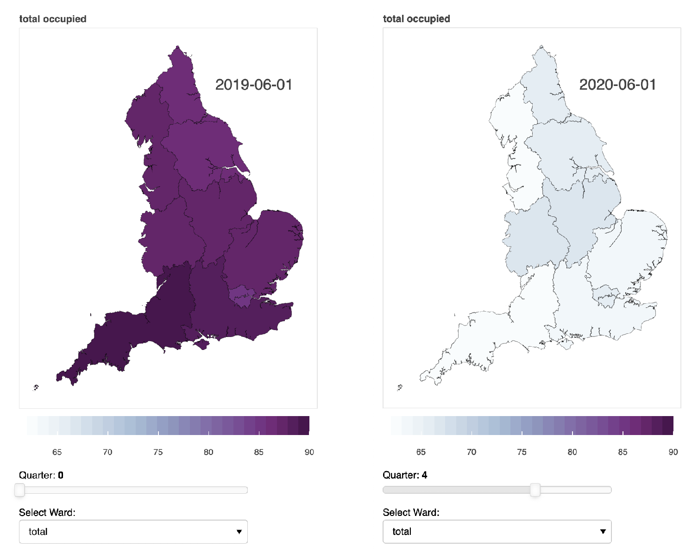

# GNI Fellowship (Financial Times) – Hospital bed occupancy before, and during, Covid

> This repository contains the code for the [visualisation](https://ukbeds.herokuapp.com/test) of hospital bed occupancy before, and during, the Coronavirus pandemic in the UK

## Summary

This visualisation shows how the number of beds occupied in different hospital departments decreased in different English regions during the first few months of the pandemic. One of the main focuses of the impact of Covid-19 on population health has been on how the hospitals’ capacity affects the mortality due to the virus. But there are other, more subtle, ways in which population health has been affected by the pandemic. Although the production of statistics for many relevant measures has been selectively [paused](https://www.england.nhs.uk/statistics/covid-19-and-the-production-of-statistics/) (e.g. critical care bed capacity and the number of cancelled urgent and elective operations), one other way to look at the broader impact is to examine the [occupancy](https://www.england.nhs.uk/statistics/statistical-work-areas/bed-availability-and-occupancy/) levels of different departments in the hospitals.
 
Overall, hospitals experienced lower bed occupancy rates across all departments (acute care, maternity, mental health, and learning disabilities) after the pandemic started compared to before. This suggests that mortality due to other causes might have been impacted due to an indirect effect of patients with other urgent health problems being unable or unwilling to access care.

## Visualisation

This [visualisation](https://ukbeds.herokuapp.com/test) shows bed occupancy throughout time in the UK (it contains additional breakdowns by region and medical specialty). This graphic can be hsoted using the [Heroku application](https://www.heroku.com/); please refresh the page if it does not load in the first instance.

## Installation

